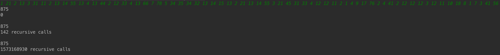

# Dynamic-Programming-Workshop (Still in Development)

### Algorithms solved in this project

#### 1. Coin-row problem
There is a row of n coins whose values are some positive integers c1, c2, . . . , cn, not necessarily distinct. The goal is to pick up the maximum amount of money subject to the constraint that no two coins adjacent in the initial row can be picked up.

This problem is solved using three approaches:
1. Bottom Up
2. Top Down
3. Naive Solution

#### 2. Change-making problem 
Consider the general instance of the following well-known problem. Give change for amount n using the minimum number of coins of denominations d1 < d2 < . . . < dm

